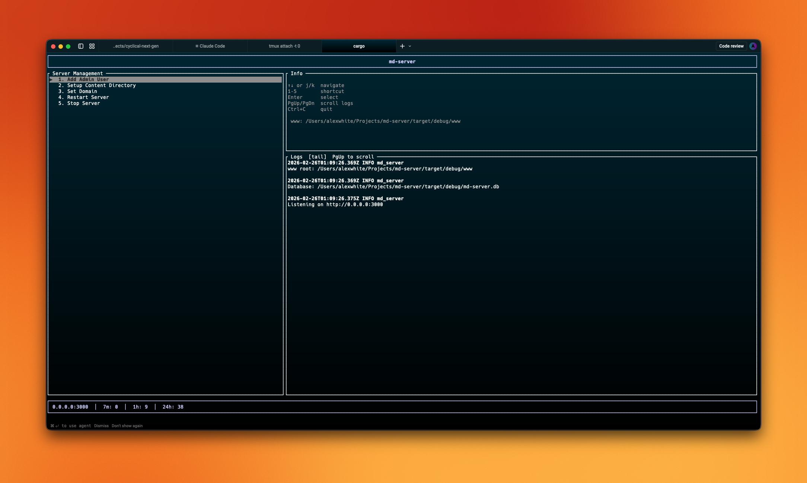
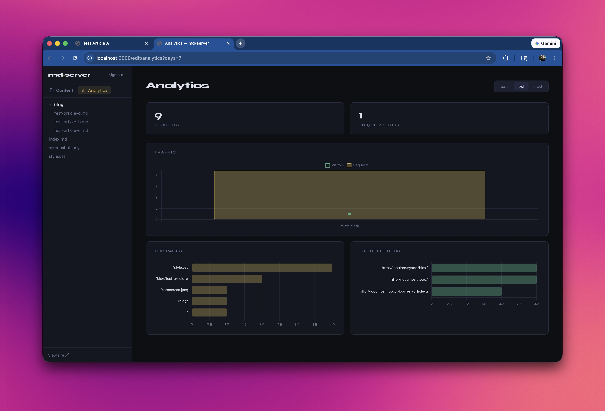
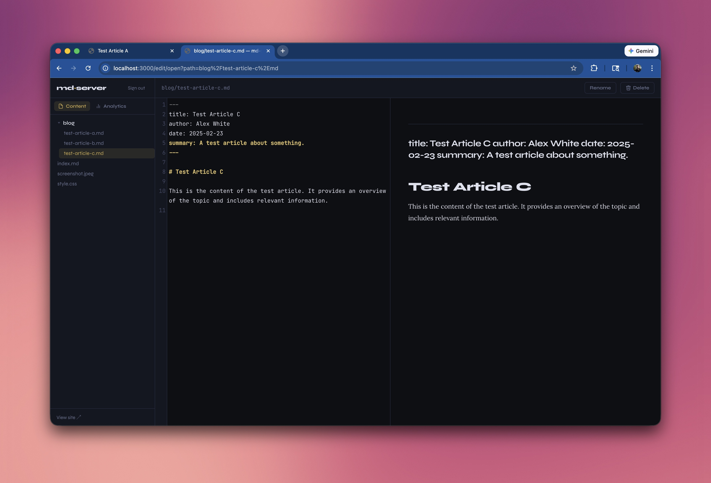

# mdServer



A single-binary Rust web server that turns a directory of Markdown files into a browsable website — no config files, no build step, no database.

Drop `.md` files in a folder. Point `md-server` at it. Done.

## Features

- **Server TUI** - Go from zero to a running server in seconds, with no config files.
- **Admin Dashboard** - Create and edit posts directly from the web.
- **Analytics** - Built-in analytics to track page views.
- **Clean URLs** — `/posts/hello` serves `posts/hello.md`
- **Auto directory listings** — sortable by date, with titles and summaries extracted from each file
- **`index.md` as a landing page** — place one in any directory to replace the auto-listing
- **YAML front matter** — `title`, `summary`, `date`, `author`; all fields are optional and inferred when absent
  - Title → first `# H1` in the document
  - Summary → first paragraph
  - Date → file modification time
- **CSS cascade** — place a `style.css` anywhere in the tree; it applies to that directory and everything beneath it
- **RSS feeds** — any listing directory automatically serves `/dir/feed.xml`
- **OpenGraph / Twitter card meta tags** — generated from front matter and a `meta.*` file found by walking up the directory tree
- **Breadcrumb navigation** — rendered as a semantic `<nav>` with correct `aria-current`
- **Static file passthrough** — CSS, JS, images, fonts, PDF, video served as-is with correct MIME types and `Content-Length`
- **Path traversal protection** — every request is `canonicalize()`d and checked against the `www_root` before any file is read
- **GFM rendering** — GitHub Flavoured Markdown via the `markdown` crate (tables, strikethrough, task lists, autolinks)
- **Graceful shutdown** — handles SIGTERM and Ctrl-C cleanly

## Screenshots




## Quick start

```bash
cargo build --release
./target/release/md-server --root ./www
```

Server listens on `http://0.0.0.0:3000` by default.

## Usage

```
md-server [OPTIONS]

Options:
  -p, --port <PORT>         Port to listen on [env: PORT] [default: 3000]
      --host <HOST>         Host to bind [env: HOST] [default: 0.0.0.0]
      --root <PATH>         www root directory [env: WWW_ROOT]
      --base-url <URL>      Absolute base URL for RSS item links (e.g. https://example.com)
```

If `--root` is not provided, `md-server` looks for a `www/` directory next to the binary — useful when deploying as a self-contained package.

## Front matter

All fields are optional. Anything missing is inferred automatically.

```yaml
---
title: My Post Title
summary: A one-sentence description shown in directory listings and og:description.
date: 2024-06-01
author: Alice
---
# My Post Title

Content goes here...
```

## Directory layout example

```
www/
├── style.css          ← applies site-wide
├── index.md           ← home page
├── about.md
└── blog/
    ├── style.css      ← overrides for /blog/ and below
    ├── hello-world.md
    └── second-post.md
```

- `GET /` → renders `index.md`
- `GET /about` → renders `about.md`
- `GET /blog/` → auto-listing of posts, sorted by date descending
- `GET /blog/feed.xml` → RSS 2.0 feed
- `GET /blog/hello-world` → renders `hello-world.md`

## RSS

Listing directories automatically serve an RSS 2.0 feed at `feed.xml` (also matches `rss.xml`). To get absolute `<link>` and `<guid>` URLs in the feed, pass `--base-url`:

```bash
md-server --root ./www --base-url https://example.com
```

## Configuration

| CLI flag     | Env var    | Default                           |
| ------------ | ---------- | --------------------------------- |
| `--port`     | `PORT`     | `3000`                            |
| `--host`     | `HOST`     | `0.0.0.0`                         |
| `--root`     | `WWW_ROOT` | `www/` next to the binary         |
| `--base-url` | `BASE_URL` | _(none — RSS links are relative)_ |

Log level is controlled by `RUST_LOG`:

```bash
RUST_LOG=md_server=debug cargo run -- --root ./www
```

## Health check

`GET /healthz` returns `200 OK` with no body. Suitable for load balancer probes.

## Building

```bash
# Requires a Rust toolchain (https://rustup.rs) and gcc
cargo build --release
```

The release binary has no runtime dependencies. Copy it anywhere alongside a `www/` directory and it runs.

## Why

Most Markdown-to-website tools require a build pipeline that produces a static output directory. `md-server` skips the pipeline entirely — it renders on request, which means edits to `.md` files are live immediately without a rebuild or deploy step. The tradeoff is that it's a running process rather than a static host, but for personal sites, internal tools, and local development it's often the simpler choice.
